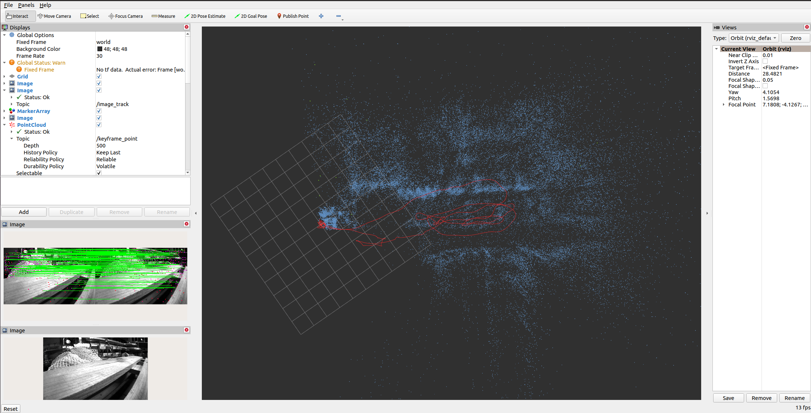
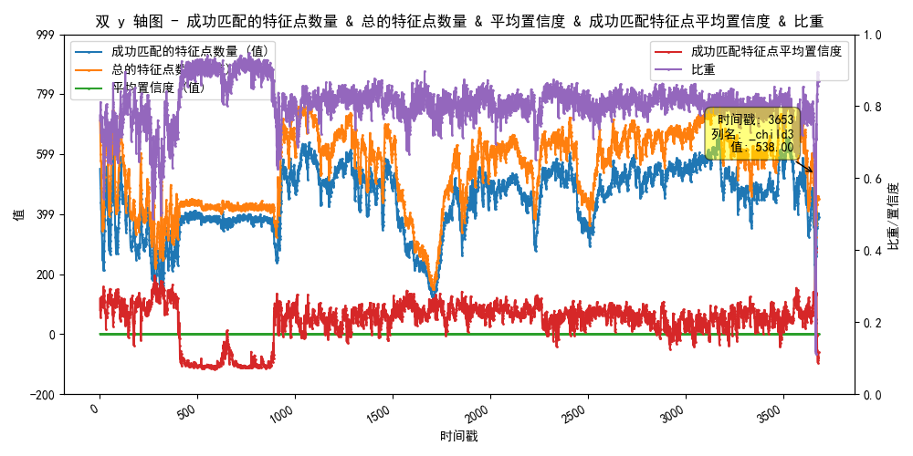

<h1 align='center' style="text-align: center;">SDR-SLAM : A Resilient SLAM Framework</h1> 

<h3 align='center' style="text-align: center;">The project is still UNDER DEVELOPMENT.</h3>

<h2 align='center' style="text-align: center;"> Hightlights of this VINS system</h2>

###  24x7 rapid response

###  Adapting to weak light and strong light challenging scenes

###  Effectively deal with optical attacks from physical hackers

###  Adaptive dynamic multi-source sensor information fusion mechanism

<div align=center></div>

<h2 align='center' style="text-align: center;"> Introduction</h2>

1) Our project is developed based on the well-known SLAM framework [vins-fusion](https://github.com/HKUST-Aerial-Robotics/VINS-Fusion).

2) We use [ZeroDCE](https://github.com/Li-Chongyi/Zero-DCE)(Zero-Reference Deep Curve Estimation for Low-Light Image Enhancement) network to enhance the visual information of camera images, which improves the viability of the visual front-end in weak light and strong light challenging scenes

3) We introduces [SuperPoint feature](https://github.com/magicleap/SuperPointPretrainedNetwork) and rebuild front-end of vins-fusion for feature point detecting and tracking.

4) We also use [G2O](https://github.com/RainerKuemmerle/g2o) (General Graph Optimization) libiary to reconstruct the back-end of vins-fusion to speed up BA optimization.

5) We designed and implemented an Adaptive Adjustment Strategy For The Weight of Visual Inertial Information Fusion, which enable the system to effectively deal with optical injection attacks of physical hackers

<div align=center>
  
  
</div>

<h2 align='center' style="text-align: center;"> Build Project and Run Demo</h2>

#### System requirements

```
ubuntu 20.04 and higher

ROS2 foxy and colcon build tools
```

#### Dependences

(A) Hardware configuration requirements

1) Host or laptop:

```
CPU: Intel i5 or higher, AMD AMD Ryzen 7 or higher

GPU: NVIDIA RTX2060 or higher

RAM： At least 8GB (32GB or higher is recommended)

SSD： At least 64GB (above 128GB is recommended)

Other hardware: no hard requirements
```

Embedded/edge computing platform (optional):

NVIDIA Jetson Nano series, NVIDIA Orin NX series, NVIDIA Jetson TX2, NVIDIA, Jetson AGX Xavier, NVIDIA Jetson Xavier NX or other embedded development or edge computing platforms that can support image graphics computing and machine learning

2) Sensor device (optional):

```
Camera: Realsecne D455i or other binocular camera

IMU (Inertial Measurement Unit): built-in camera or other independent IMU devices
```

(B) Operating system requirements

Operating system requirements for running this software:

```
Linux: Ubuntu 20.04.6 LTS or other Linux distributions that support ROS2 systems

Windows: Windows 10 or higher

Requirements for robot operating system (ROS):

ROS2 foxy (ROS2 release supported by Ubuntu 20.04.6 LTS)

Refer to https://docs.ros.org/en/rolling/Releases.html

For this software, the preferred operating system configuration is Ubuntu 20.04.6 LTS+ROS2 fox.
```

(C) Third party libraries and drivers that software depends on

```
Cmake-3.20, gcc/g++7 or other compiler tools that support the C++17 standard

Eigen-3.39 [https://gitlab.com/libeigen/eigen/]

Ceres-Solver-2.1.0 [http://ceres-solver.org/]

OpenCV 4.2.0（CUDA Enable）[https://opencv.org/releases/]

Python 3.8 (Python version of Ubuntu 20.04.6 LTS)

CUDA-12.1

CUDA-Toolkit

NVIDIA driver version: 535 and above
```

#### Build commands

1) To build this project, first you need to clone this project form Github

2) Then run the script build with command

```
cd [PATH_TO_YOUR_PROJECT_FILE]

sudo chmod +x build.sh

./build.sh
```

Just wait for a moment while you first build it.

#### Run

To run the system, we provide you the config file to run euroc dataset

```
cd [PATH_TO_YOUR_PROJECT_FILE]

sudo chmod +x run_euroc.sh

./run_euroc.sh
```

1) The script run_euroc.sh will open 4 bash windows, find the window with name "sp_node", input the initial paramters [nms_dist conf_thresh nn_thresh] for superpoint network

2) We recommend that

```
nms_dist = 10
conf_thresh = 0.08
nn_thresh = 0.5
```

<h4 align='center' style="text-align: center;">Developed by the Security of Unmanned-System Laboratory<br>Northwestern Polytechnical University (NWPU, China)</h4>
