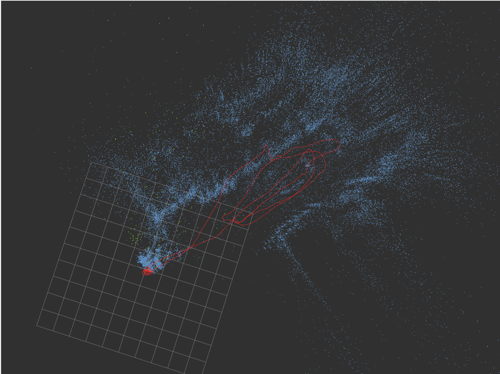

# SDR-SLAM

## A Resilient SLAM Framework Adapting To Challenging Scenes And Can Effectively Deal With Optical And Acoustic Attacks

## Developed by the Unmanned-System Security Laboratory of Northwestern Polytechnical University (USSL, NWPU)

