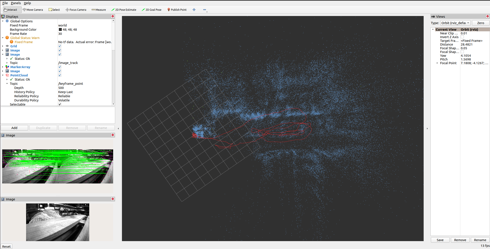

<h1 align='center' style="text-align: center;">SDR-SLAM : A Resilient SLAM Framework</h1> 

## Hightlights of this VINS system

### 1) Adapting To Challenging Scenes

### 2) Effectively Deal With Optical And Acoustic Attacks

#### Developed by the Unmanned-System Security Laboratory of Northwestern Polytechnical University (USSL, NWPU)

