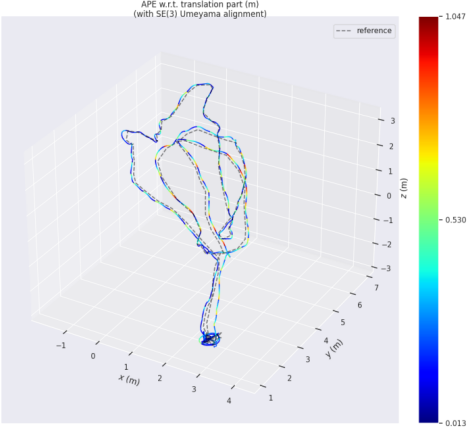

<h1 align='center' style="text-align: center;">SDR-SLAM : A Resilient SLAM Framework</h1> 

<h3 align='center' style="text-align: center;">The project is still UNDER DEVELOPMENT.</h3>

<h2 align='center' style="text-align: center;"> Hightlights of this VINS system</h2>

###  24x7 rapid response

###  Adapting to weak light and strong light challenging scenes

###  Effectively deal with optical attacks from physical hackers

###  Adaptive dynamic multi-source sensor information fusion mechanism

<div align=center></div>

<h2 align='center' style="text-align: center;"> Introduction</h2>

1) Our project is developed based on the well-known SLAM framework [vins-fusion](https://github.com/HKUST-Aerial-Robotics/VINS-Fusion).

2) We use [ZeroDCE](https://github.com/Li-Chongyi/Zero-DCE)(Zero-Reference Deep Curve Estimation for Low-Light Image Enhancement) network to enhance the visual information of camera images, which improves the viability of the visual front-end in weak light and strong light challenging scenes

3) We introduces [SuperPoint feature](https://github.com/magicleap/SuperPointPretrainedNetwork) and rebuild front-end of vins-fusion for feature point detecting and tracking.

4) We also use [G2O](https://github.com/RainerKuemmerle/g2o) (General Graph Optimization) libiary to reconstruct the back-end of vins-fusion to speed up BA optimization.

5) We designed and implemented an Adaptive Adjustment Strategy For The Weight of Visual Inertial Information Fusion, which enable the system to effectively deal with optical injection attacks of physical hackers

<div align=center>
  
  
</div>

<h2 align='center' style="text-align: center;"> Build Project and Run Demo</h2>

#### System requirements

```
ubuntu 20.04 and higher

ROS2 foxy and colcon build tools
```

#### Dependences

#### Build commands

#### Run

<h2 align='center' style="text-align: center;"> About ROS2 Foxy</h2>

<h2 align='center' style="text-align: center;"> Papers and Related Works</h2>

<h4 align='center' style="text-align: center;">Developed by the Security of Unmanned-System Laboratory<br>Northwestern Polytechnical University (NWPU, China)</h4>
